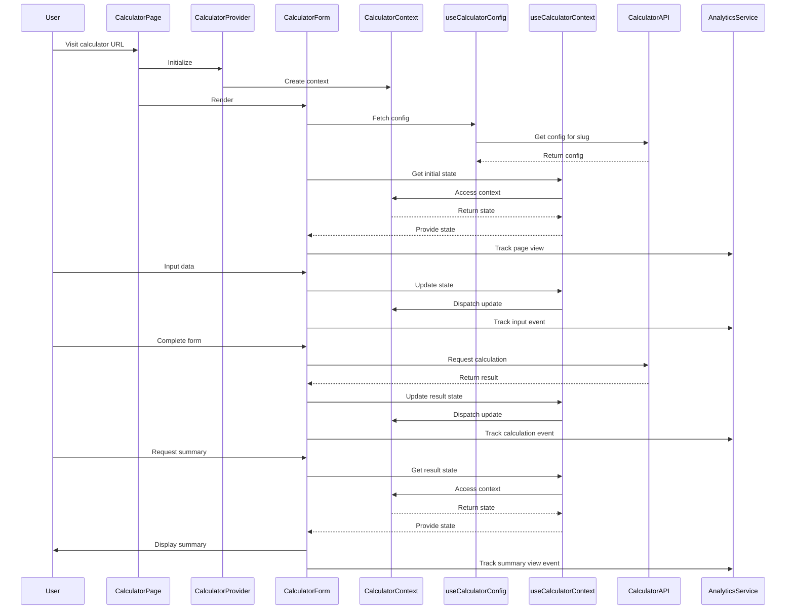

# Calculator System Technical Specification

## 1. Project Structure

```
src/
├── app/
│   ├── api/
│   │   └── [...] (API route handlers)
│   ├── [calculator-slug]/
│   │   └── page.tsx (dynamic route for calculators)
│   └── page.tsx (home page)
├── features/
│   ├── calculator/
│   │   ├── components/
│   │   │   ├── calculator-form.tsx
│   │   │   └── summary.tsx
│   │   ├── contexts/
│   │   │   └── calculator-context.tsx
│   │   ├── hooks/
│   │   │   ├── use-calculator-config.ts
│   │   │   └── use-calculator-context.ts
│   │   ├── schemas/
│   │   │   └── calculator-config.schema.ts
│   │   ├── services/
│   │   │   └── calculator-api.ts
│   │   └── types/
│   │       └── calculator.types.ts
│   └── analytics/
│       ├── hooks/
│       │   └── use-analytics.ts
│       └── services/
│           └── analytics-service.ts
├── shared/
│   ├── components/
│   │   └── [...] (shared components)
│   └── utils/
│       └── [...] (utility functions)
└── styles/
    └── [...] (global styles)
```

## 2. Sequence Diagram



## 3. Example Calculator Configuration

```json
{
  "slug": "web-extension-development",
  "name": "Web Extension Development Calculator",
  "description": "Calculate the cost and timeline for developing a web browser extension",
  "questions": [
    {
      "id": "browser-support",
      "text": "Which browsers do you want to support?",
      "type": "multiple",
      "options": ["Chrome", "Firefox", "Safari", "Edge"]
    },
    {
      "id": "functionality",
      "text": "What is the primary functionality of your extension?",
      "type": "single",
      "options": [
        "Content modification",
        "Data collection",
        "User interface enhancement",
        "Backend integration"
      ]
    },
    {
      "id": "data-storage",
      "text": "Will your extension require data storage?",
      "type": "single",
      "options": ["Yes", "No"]
    },
    {
      "id": "api-integration",
      "text": "How many external APIs will your extension integrate with?",
      "type": "number"
    },
    {
      "id": "user-authentication",
      "text": "Will your extension require user authentication?",
      "type": "single",
      "options": ["Yes", "No"]
    },
    {
      "id": "ui-complexity",
      "text": "How would you describe the complexity of your extension's user interface?",
      "type": "single",
      "options": ["Simple", "Moderate", "Complex"]
    },
    {
      "id": "expected-users",
      "text": "How many users do you expect your extension to have in the first year?",
      "type": "number"
    }
  ]
}
```

## 4. Key Components

### CalculatorProvider

- Wraps the entire calculator application
- Initializes and provides the CalculatorContext

### CalculatorContext

- Holds the UI state:
  - currentStep: number
  - formData: object
  - calculationResult: object
  - sessionId: string
  - referralUrl: string

### useCalculatorContext (Hook)

- Provides access to the CalculatorContext state and dispatch function

### useCalculatorConfig (Hook)

- Fetches and provides the calculator configuration based on the slug

### CalculatorForm

- Renders the form based on the fetched configuration
- Uses useCalculatorContext for state management
- Handles user input and form progression

### Summary

- Displays the calculation results
- Uses useCalculatorContext to access the final state

### CalculatorAPI (Service)

- Handles API calls for fetching config, saving sessions, and performing calculations

### AnalyticsService

- Tracks user events throughout the calculator journey

## 5. Key Features

1. Dynamic calculator creation based on JSON configuration
2. Centralized state management using React Context
3. Type-safe development with TypeScript and Zod schema validation
4. Efficient data fetching and caching with react-query
5. Analytics integration for tracking user behavior
6. Modular and scalable architecture using feature-based folder structure

## 6. Next Steps

1. Implement the CalculatorProvider and CalculatorContext
2. Develop the CalculatorForm component with dynamic rendering based on config
3. Create the Summary component for displaying results
4. Implement the CalculatorAPI service for backend communication
5. Integrate the AnalyticsService for event tracking
6. Develop and test sample calculator configurations
7. Implement error handling and loading states
8. Create documentation for adding new calculator types
